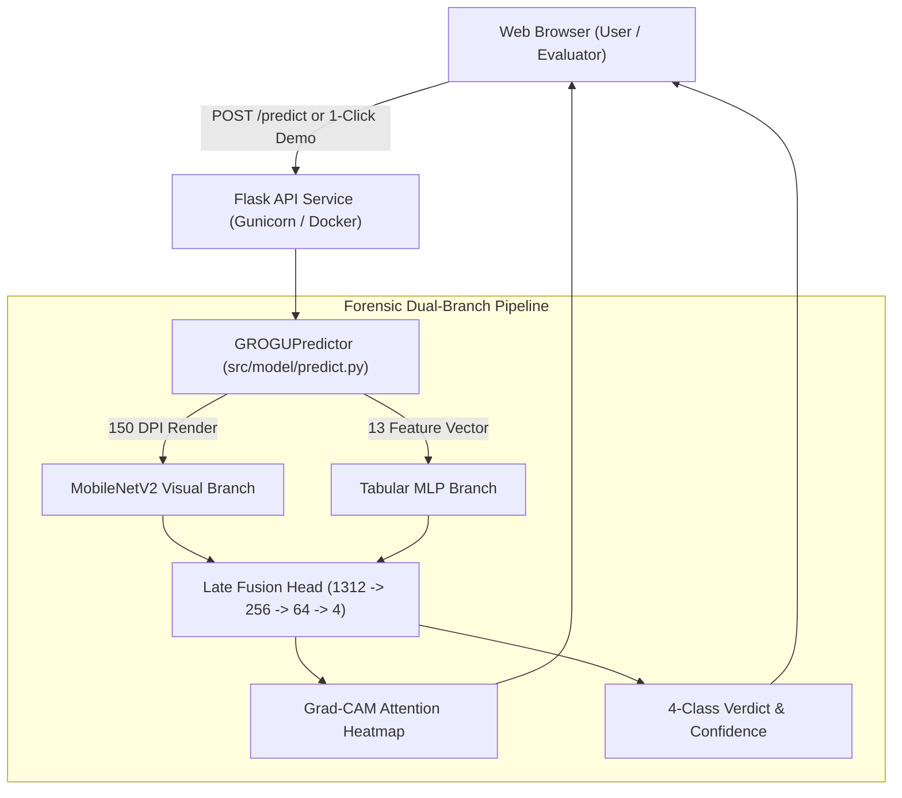

# GROGU — Cloud Hosting & Deployment Guide

This guide provides step-by-step instructions to deploy GROGU online so anyone (evaluators, users, and reviewers) can test the live forensic engine from any browser.

---

## Option 1: Hugging Face Spaces (Recommended — 100% Free & Persistent)

Hugging Face Spaces offers free CPU hosting with a permanent public HTTPS URL (`https://huggingface.co/spaces/<your-username>/grogu`), automatic SSL certificates, and zero cold-start sleep issues.

### Step-by-Step Deployment:
1. Log in to [Hugging Face](https://huggingface.co/) and click **New Space** (or go to `https://huggingface.co/new-space`).
2. Fill in the Space settings:
   - **Space name:** `grogu-kyc-forensics`
   - **License:** `apache-2.0` or `mit`
   - **Space SDK:** Select **Docker** -> **Blank**
   - **Space Hardware:** Select **CPU basic • 2 vCPU • 16 GB • Free**
   - **Visibility:** Public
3. Clone your new Hugging Face Space repository locally:
   ```bash
   git clone https://huggingface.co/spaces/<your-username>/grogu-kyc-forensics
   cd grogu-kyc-forensics
   ```
4. Copy the deployment files from this project into your Space folder:
   - `Dockerfile`
   - `requirements.txt`
   - `app.py`
   - `index.html`
   - `demo_samples/` (all 4 sample PDFs)
   - `src/model/architecture.py`
   - `src/model/predict.py`
   - `src/model/grogu_model.pth`
   - `dataset/dataset_generator.py`
5. Commit and push to Hugging Face:
   ```bash
   git add .
   git commit -m "feat: deploy GROGU v2.0 bimodal forensic engine"
   git push origin main
   ```
6. Hugging Face will automatically build the Docker container and provide a live public URL in ~2 minutes!

---

## Option 2: Render.com (Web Service)

Render provides direct GitHub repository integration with automatic deployment.

1. Push your repository to GitHub: `https://github.com/Jaidealistic/nndl.git`
2. Go to [Render Dashboard](https://dashboard.render.com/) and click **New +** $\rightarrow$ **Web Service**.
3. Connect your GitHub repository `Jaidealistic/nndl`.
4. Configure settings:
   - **Environment:** Docker
   - **Region:** Singapore or Frankfurt (closest latency)
   - **Branch:** `main`
   - **Plan:** Free
5. Click **Create Web Service**.
6. Render builds the Docker image and provides a public URL (e.g., `https://grogu-kyc.onrender.com`).

---

## Option 3: Local / Intranet Microservice (Edge Native)

To run the offline forensic dashboard locally:

```bash
# Using the local environment
C:\gv\Scripts\python.exe app.py
```
Open your browser at: `http://localhost:5000`

---

## System Architecture for Online Hosting



---

## Verification Checklist for Evaluators
- [x] **1-Click Forensic Sandbox:** Test all 4 classes (*Genuine*, *Font Tampered*, *Metadata Tampered*, *Both Tampered*) with a single click without file uploads.
- [x] **Drag & Drop Custom PDFs:** Upload any real or synthetic KYC PDF for instant analysis.
- [x] **Visual Evidence Overlay:** Inspect the red Grad-CAM heatmap highlighting tampered fields.
- [x] **Metadata Telemetry Table:** View real-time software producer legitimacy, creation dates, and temporal delta.
